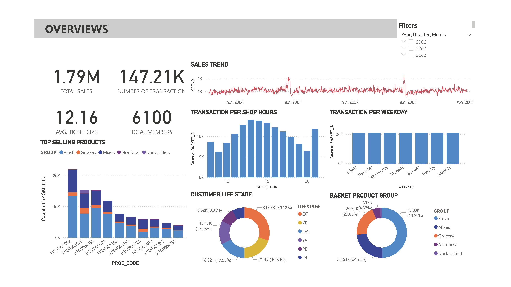
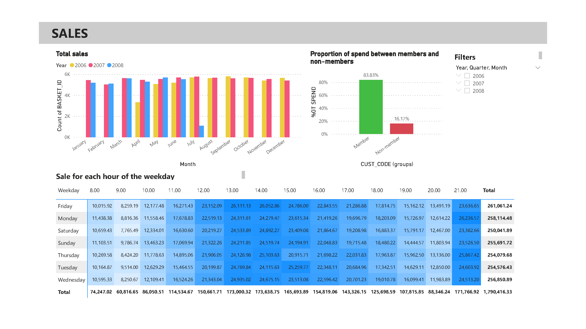
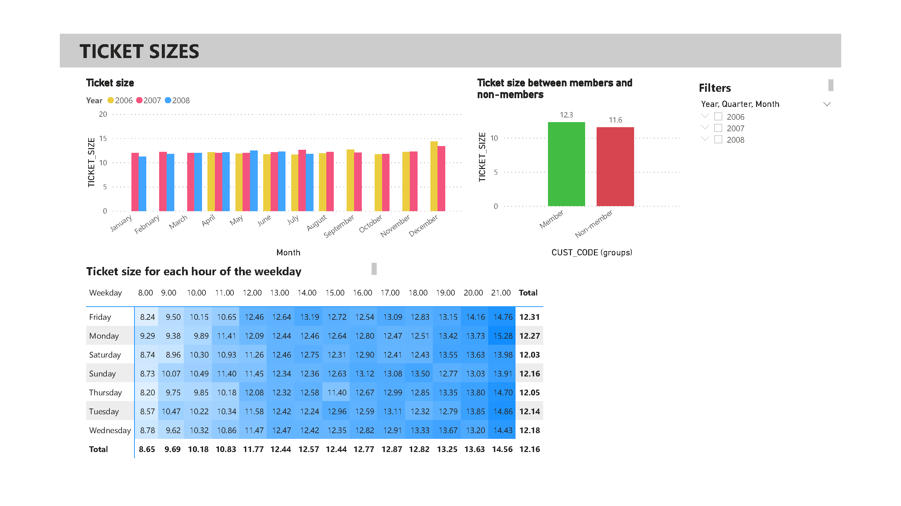
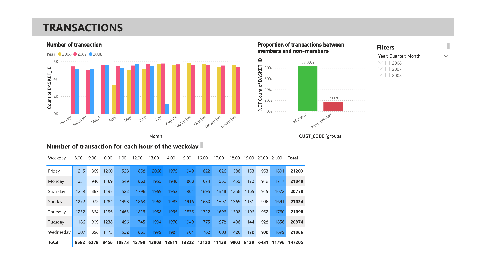

# CLV Dashboard

## Dataset
[supermarket data](https://github.com/NittyNice/BADS7105-CRM-Analytics/blob/main/data/Supermarket%20Data.csv) is table that records each individual transaction are including basket information, customer information, product information, date, quantity, spend, and store information.

## Overview

## Sales

## Ticket size

## Transactions

