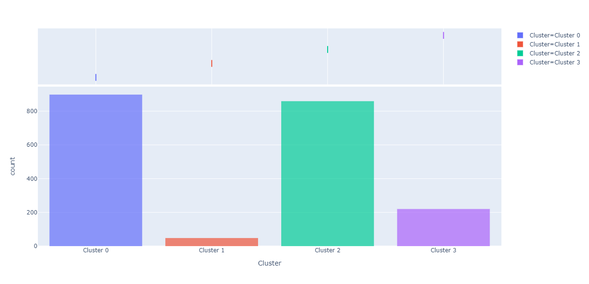

# Customer Segmentation

## Notebook
 
 

## Dataset
[supermarket data](https://github.com/NittyNice/BADS7105-CRM-Analytics/blob/main/data/Supermarket%20Data.csv) is table that records each individual transaction are including basket information, customer information, product information, date, quantity, spend, and store information.  

## Requirement
- [PyCaret](https://pycaret.org/) is an open source, low-code machine learning library in Python that allows you to go from preparing your data to deploying your model within minutes.
- [Plotly](https://plotly.com/), The front end for ML and data science models.

## Process Overview

## Features Engineering
Select and calculate features for create clustering model show below:  
- `Total spend`: sum of spending
- `Total visits`: total number transactions (by count distinct BASKET ID)
- `Total SKUs`: total number of product SKUs that individual user has purchased (by count distinct PRODUCT CODE)
- `Ticket size`: average spend per transaction (by Total spend/Total visits)
- `Total days`: time period from the first transaction to the last in days
- `Recency`: duration in days from the last transaction
- `Lifetime visit frequency`: frequency of transactions per day over the lifetime relationship

## K-Means Clustering
We found that the number of customers who made only one transaction is 2,025 and the rest of 4,075 customers made at least 2 transactions.  
  
In one transaction group, certain features are available to create clustering model, becouse everyone has same value of `Total visits` and `Total days` and certain features calculate by some features with `Total visits`. Therefore, it splits into two groups and creates a specific model for each group.  

### 1) One Time Purchase
#### Features
`Total spend` : sum of all spend.  
`Total SKUs` : total of product types that customer purchased.  
`Recency` : duration in days customer gone since last transaction.  

#### Choosing K clusters
Considering by elbow, we will be choose 4 clusters. Considering by matrics, the best score of Calinski-Harabaszwe and Davies-Bouldin are in 3 clusters.
When considering together, elbow and matrics, 4 clusters is a best choice because Calinski-Harabaszwe of 4 clusters is close to 3 clusters and silhouette is better than 3 clusters.  

#### Visualization Model
##### Clustering Model with K=3

##### Clustering Model with K=4

#### Interpretation
##### Clustering Model with K=3

##### Clustering Model with K=4

##### Visualize Group Transfer

##### Denominate cluster
**K=3**
- Cluster 0 : a group of customer who have transacted recently, averaging less than 1 year, and those with low spending and a few SKUs.  
- Cluster 1 : a group of customer who have high spending transaction and various SKUs on diverse recency, both long time ago and recently.  
- Cluster 2 : a group of customer who have transacted long time ago, averaging more than a year, and those with low spending and a few SKUs.  

**K=4**
- Cluster 0, 1 and 2 same as above.
- Cluster 3 : a group of customer who have moderate spending and quite a variety of SKUs on diverse recency, both long time ago and recently. This cluster are separated from cluster 0, 1 and 2.  

**Action**

### 2) Many Time Purchase
#### Features
`Total spend` : sum of all spend.  
`Total visits` : total number transactions.  
`Total SKUs` : total of product types that customer purchased.  
`Ticket size` : average spend per transaction.  
`Total days`: time period of relationship.  
`Recency` : duration in days customer gone since last purchased.  
`Lifetime visit frequency`: frequency of transactions per day over the lifetime relationship.  

#### Choosing K clusters
Considering by elbow, we will be choose 5 clusters. Considering by matrics, the best of all scores are in 2 clusters, but it is not a good idea to cluster into 2 group.
When considering together, elbow and matrics, 4 or 5 clusters is a good choice because Calinski-Harabaszwe are not much decreased from the highest and silhouette are the second and third highest.  

#### Visualization Model
##### Clustering Model with K=4

##### Clustering Model with K=5

##### Clustering Model with K=6

#### Interpretation
##### Clustering Model with K=4

##### Clustering Model with K=5

##### Clustering Model with K=6

##### Visualize Group Transfer

##### Denominate cluster
**K=4**
- Cluster 0 :  
- Cluster 1 :  
- Cluster 2 :  
- Cluster 3 : 

**K=5**

**K=6**

**Action**

