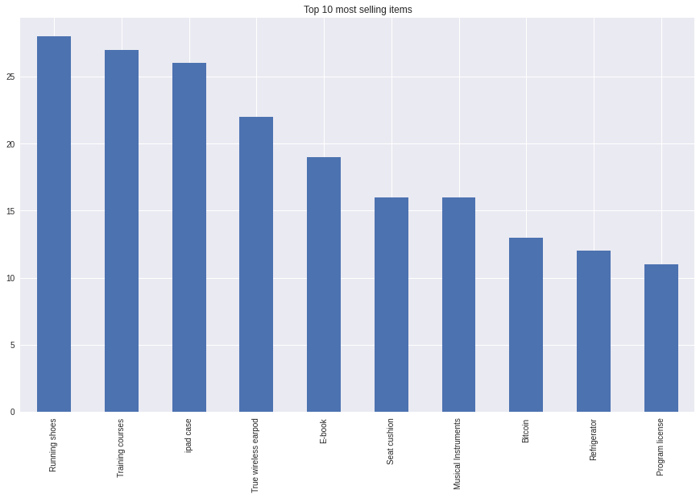
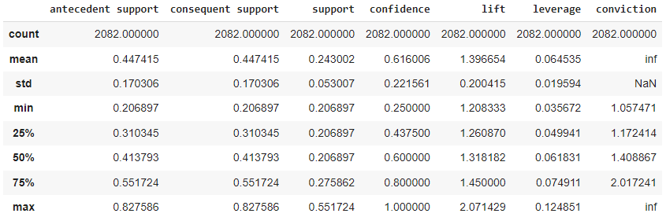
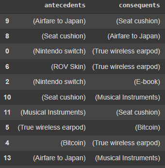
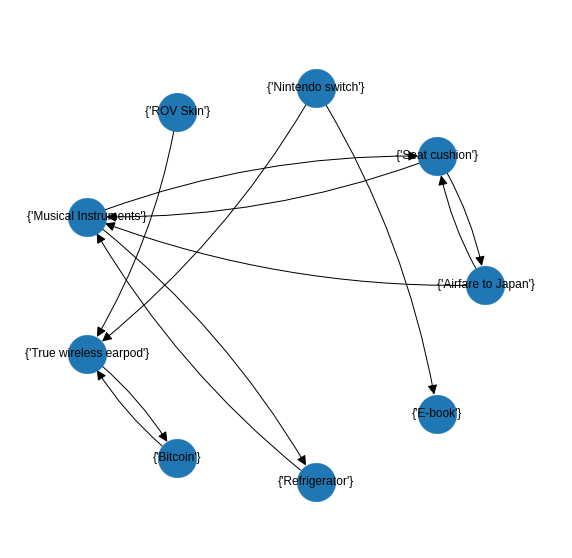
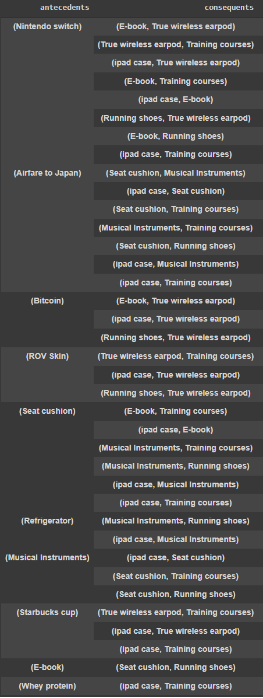
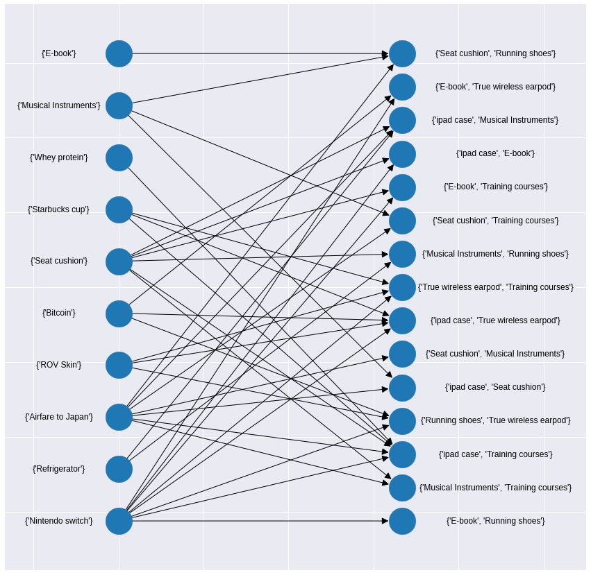

# Product Reccommendation

## Notebook
 

## Dataset
[Customet Preference Survey](https://github.com/NittyNice/BADS7105-CRM-Analytics/blob/main/data/Customer%20Preference%20Survey.csv) is survey about lists of product that asked respondents have been purchased or never purchased.

## Requirement
- [MLxtend](http://rasbt.github.io/mlxtend/) is a Python library of useful tools for the day-to-day data science tasks.  
- [NetworkX](https://networkx.org/) is a Python package for the creation, manipulation, and study of the structure, dynamics, and functions of complex networks.

## Process Overview

## Top 10 best sellers
There were a total of 26 products in the survey. We want to know the top 10 most popular products.  

## Market Basket Analysis with Association Rules
### Key terms  
1) Itemset: A group of one or more products is represented by the symbol set {X} e.g. {ipad case, Refrigerator, Running shoes}.
2) Association rule: relationship rules Between the two itemset, an association rule is an implication expression of the form Itemset LHS (Left-hand side) => Itemset RHS (Right-hand side) e.g. {ipad case, Refrigerator, Running shoes} => {Musical Instruments}.

### Metrics  
Metrics for evaluating association rules and setting selection thresholds are listed below:

1) Support  
The table produced by the association rule mining algorithm contains three different support metrics: 'antecedent support', 'consequent support', and 'support'. Here, 'antecedent support' computes the proportion of transactions that contain the antecedent LHS, 'consequent support' computes the support for the itemset of the consequent RHS and, 'support' computes the proportion of transactions that contain the antecedent LHS and consequent RHS otgether.  

  support(LHS => RHS) = support(LHS &cup; RHS) , range: [0, 1]

2) Confidence  
The confidence of a rule LHS => RHS is the probability of seeing the consequent in a transaction given that it also contains the antecedent. Note that the metric is not symmetric or directed; for instance, the confidence for LHS => RHS is different than the confidence for RHS => LHS. The confidence is 1 (maximal) for a rule LHS => RHS if the consequent and antecedent always occur together.  
  
  

  confidence(LHS => RHS) = support(LHS => RHS) / support(LHS) , range: [0, 1]

  
  
3) Lift  
The lift metric is commonly used to measure how much more often the antecedent and consequent of a rule LHS => RHS occur together than we would expect if they were statistically independent. If LHS and RHS are independent, the Lift score will be exactly 1.    
  
  

  lift(LHS => RHS) = confidence(LHS => RHS) / support(RHS) , range: [0, &infin;]

  
  
4) Leverage  
Leverage computes the difference between the observed frequency of LHS and RHS appearing together and the frequency that would be expected if LHS and RHS were independent. A leverage value of 0 indicates independence.  
  
  

  levarage(LHS => RHS) = support(LHS => RHS) - (support(LHS) X support(RHS)) , range: [-1, 1]

  
  
5) Conviction  
A high conviction value means that the consequent is highly depending on the antecedent. For instance, in the case of a perfect confidence score, the denominator becomes 0 (due to 1 - 1) for which the conviction score is defined as 'inf'. Similar to lift, if items are independent, the conviction is 1.  
  
  

  conviction(LHS => RHS) = (1 - support(RHS)) / (1 - confidence(LHS => RHS)) , range: [0, &infin;]

  
  
## Rule statistics

## Buy 2 get 15% off on top!
### 1) Already add antecedent on basket, recommend the consequent. 
When a customer picks up one item, we will recommend another item that is frequently bought together.
- confidence >= 0.4375  (at the 25th percentile)
- life >= 1.2

Table:  

Visualize:  

### 2) Pop up advertising, "Product Matching Discount" for who already have certain itemset on basket.  
When a customer picks up one item, we will recommend a pair of products with discount that is frequently bought together after pick antecedent item.
- confidence >= 0.6  (at the 50th percentile)
- life >= 1.2

Table:  

Visualize:  

