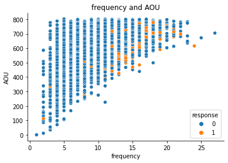
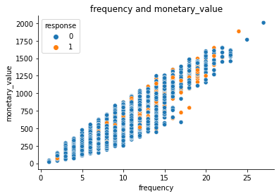
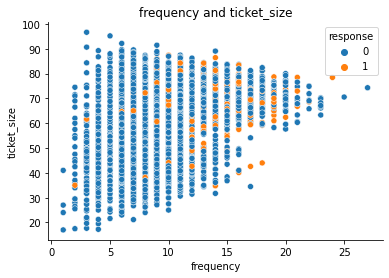
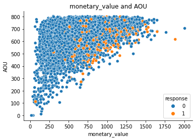
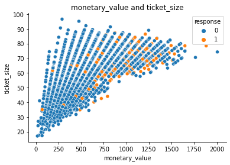
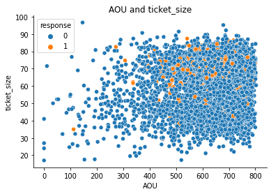
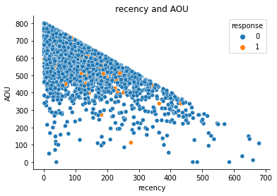
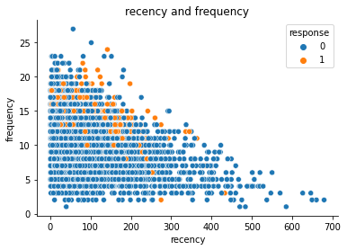
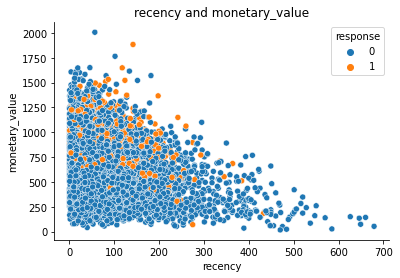
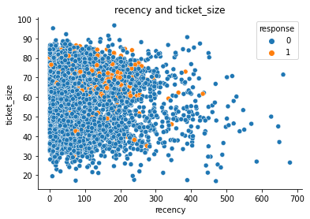

# Campaign response

## Notebook
 

## Dataset
[Retail_Data_Response.csv](https://github.com/NittyNice/BADS7105-CRM-Analytics/blob/main/data/Retail_Data_Response.csv) is a dataset about responses to campaigns of individual customer.  
[Retail_Data_Transactions.csv](https://github.com/NittyNice/BADS7105-CRM-Analytics/blob/main/data/Retail_Data_Transactions.csv) is a dataset about transaction of individual customer include date and transaction amount.

## Process Overview

## Feature Engineering
We create features based on 2 analysis technique:
1) CLV (Customer Lifetime Value)
2) RFM (Recency, Frequency, and Monetary value)

### Visualize the correlation between each pair of variables
1) CLV  
  
  
  
  
 

1) RFM  
  

