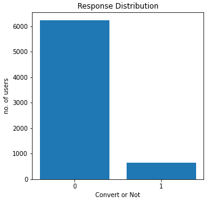
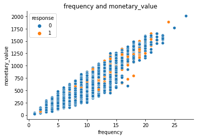
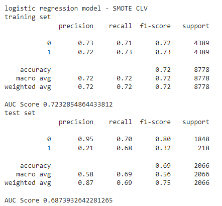
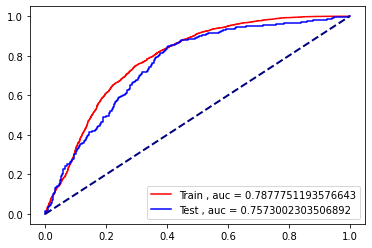
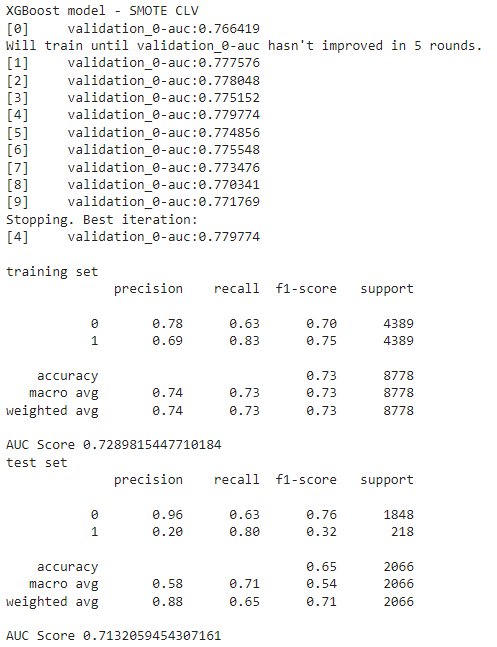
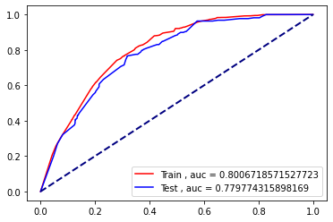
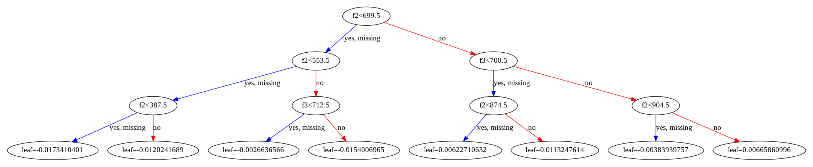

# Campaign response

## Notebook
 

## Dataset
[Retail_Data_Response.csv](https://github.com/NittyNice/BADS7105-CRM-Analytics/blob/main/data/Retail_Data_Response.csv) is a dataset about responses to campaigns of individual customer.  
[Retail_Data_Transactions.csv](https://github.com/NittyNice/BADS7105-CRM-Analytics/blob/main/data/Retail_Data_Transactions.csv) is a dataset about transaction of individual customer include date and transaction amount.

## Process Overview

## Feature Engineering
We create features based on 2 well known analysis techniques.:
1) CLV (Customer Lifetime Value)
2) RFM (Recency, Frequency, and Monetary value)

### Visualize Response Distribution
First, we take a look at amount of customer who response and non-response to campaign.

### Visualize the correlation between each pair of variables
Next, we create features based on 2 well known analysis techniques.
1) CLV  
  
  
  
  
 

1) RFM  
  

### Deal with imbalanced data and split train/test
Lastly, we fixed imbalanced with SMOTE and split data to train set and test set with a ratio of 70/30.

## Classification Model
### Model 1 : Logistic Regression
1) CLV  

- Evaluation  

2) RFM  

- Evaluation  

### Model 2 : XGBoost
1) CLV  

- Evaluation  

- Visualize classification tree  

2) RFM  

- Evaluation  

- Visualize classification tree  

