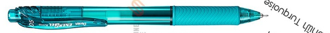

# AB testing
 
 
 
 ## Dataset
 [AB testing survey](https://github.com/NittyNice/BADS7105-CRM-Analytics/blob/main/data/AB Testing Survey.csv) is a preference questionnaire between warm and cool colored pens. The survey required gender, purpose of pen and satisfy score of different colored pen.
 
 ## 
 The objective of the AB test is to choose a pen color, turquoise and orange, to give an office workers.  
  
 
 
