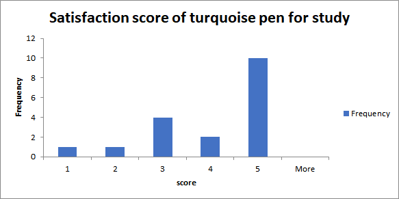

# AB testing
 
 
 
## Dataset
[AB testing survey](https://github.com/NittyNice/BADS7105-CRM-Analytics/blob/main/data/AB%20Testing%20Survey.csv) is a preference questionnaire between warm and cool colored pens. The survey required gender, age, purpose of pen and satisfy score of different colored pen.
- Gender : Male, Female
- Age : Integer
- Purpose : Study, Work
- Satisfaction Score of each pen : 1 - 5 (5 = Very satisfied)
 
## Survey
The objective of the AB test is to choose a pen color, turquoise and orange, to give an attendees.  

 
 
## Exploratory Data Analysis
Take a look at the proportion between men and women and the proportion of the purpose of use.  
There are 50 respondents.  
Geder  
Male: 32  
Female: = 18  

The purpose of pen  
For work: 32  
For study: 18  

 
 
Next, look at the mean and variance of satisfaction scores.  

 
## Hypothesis Testing overall  
#### satisfy score distribuion  
 

#### T-Test

## Hypothesis Testing Gender Effect
#### satisfy score distribuion  
  
 

#### T-Test

## Hypothesis Testing Purpose Effect  
#### satisfy score distribuion  
  
 

#### T-Test

 
