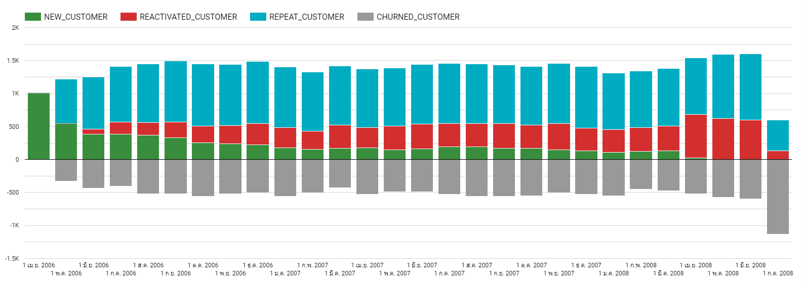

# Customer Movement Analysis
 

## Dataset
[supermarket data](https://github.com/NittyNice/BADS7105-CRM-Analytics/blob/main/data/Supermarket%20Data.csv) is table that records each individual transaction are including basket information, customer information, product information, date, quantity, spend, and store information.

## Objective
We want to display proportion of customers who make transaction each month, which are divided into 4 groups:
1) Repeat: Group of customers who made a transaction in the last month and still purchase in the current month.
2) Reactiveate: Group of customers who made a transaction before but in the previous month did not come to purchase. Then, they come back and buy in the current month.
3) New: Group of new customers who made a first transaction in the current month.
4) Churn: Group of customers who made a transaction in the last month but did not come to purchase in the current month.

| Status | Current | Previous | Before |
| --- | --- | --- | --- |
| Repeat | ✅ | ✅ | |
| Reactivated | ✅ | ❌ | ✅ |
| New | ✅ | ❌ | ❌ |
| Churn | ❌ | ✅ | |

## Data Preparation
**SQL:** [customer_movement.sql](./customer_movement.sql)  

## Result
**CSV:** [customer_movement.csv](./customer_movement.csv)  
**JSON:** [customer_movement.json](./customer_movement.json)  

## Visualization

