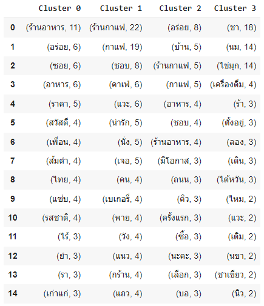
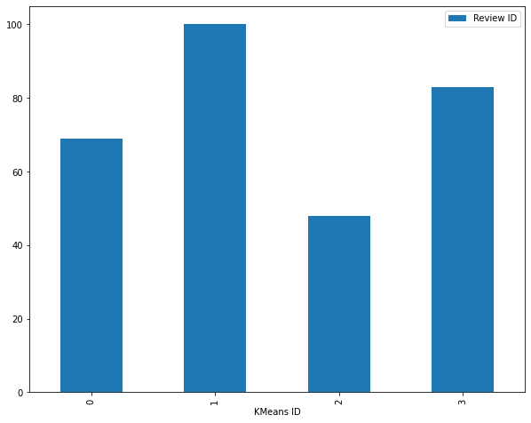

# Voice of Customet

## Dataset
[Wongnai Review](https://github.com/NittyNice/BADS7105-CRM-Analytics/blob/main/data/Wongnai%20Reviews%20-%20Small.csv) is a dataset of reviews for restaurant from [Wongnai](https://www.wongnai.com/), Thailand’s leading super-lifestyle platform, has connected people to good stuff through its comprehensive content and users’ reviews on restaurants, recipes, beauty, and travels.

## Requirement
- [tensorflow text](https://www.tensorflow.org/text) is a TensorFlow library of text related ops, modules, and subgraphs. The library can perform the preprocessing regularly required by text-based models, and includes other features useful for sequence modeling not provided by core TensorFlow.  
- [UMAP](https://umap-learn.readthedocs.io/en/latest/) or Uniform Manifold Approximation and Projection (UMAP) is a dimension reduction technique that can be used for visualisation similarly to t-SNE, but also for general non-linear dimension reduction.  
- [PyThaiNLP](https://pythainlp.github.io/tutorials/) is a Python library for Thai Natural Language Processing.  

## Process Overview

## Clustering

- **Cluster 0: cafe hopper**  
A group of reviewers who like to hunt for coffee shops and bakeries. The atmosphere is an important role in deciding by keyword 'น่ารัก' mean 'cute' and 'แนว' mean 'style'. **This group of reviewers tends to influence a wide range of people. Therefore, it is important to pay attention to the service in order to give them a best impression and give positive review the store.**

- **Cluster 1: strength flavor**
A group of reviewers who like the strength flavor of food by keywords 'ส้มตำ' mean 'Green Papaya Salad (spicy Thai food)' ,'แซ่บ' mean 'yummy', 'รสชาติ' mean 'flavor' and 'ยำ' mean 'spicy salad'. Spicy Thai food is easy to find in general, but not every restaurant is delicious. Keyword 'อร่อย' mean 'delicious' indicates that this group tend to find delicious restaurants to satisfy their needs. **It is well known that the strong, mean spicy, flavor has an extreme effect on both likes and dislikes. Mind your flavor and satisfy them to give you the best reviews.**

- **Cluster 2: Genaral restaurant lover**
A group of reviewers who like the store and leave reviews. The firest keyword is 'อร่อย' mean 'delicious', it indicate of satisfaction in the store they purchase. And others key, 'ร้านกาแฟ' meab 'cefe', 'กาแฟ' mean 'coffee', 'อาหาร' mean 'food', 'ชอบ' mean 'like' and 'ร้านอาหาร' mean 'restaurant' indicate that it doesn't have a specific store type.**

- **Cluster 3: Bubble tea heal their life**
A group of reviewers who love bubble tea. Follwer ther top keywords 'ชา' mean 'tea', 'นม' mean 'milk' and 'ไข่มุก' mean 'bubble' are identify this group as bubblb tee lover. **No more words, just fulfill their life.**

